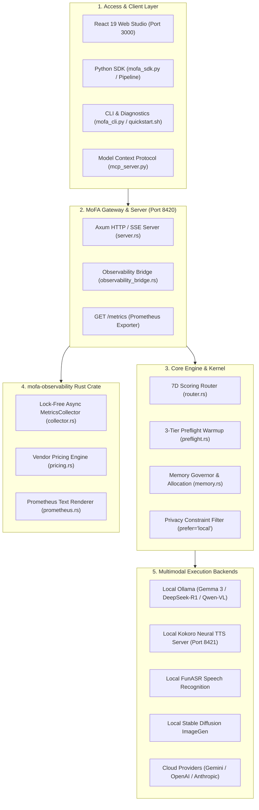

# Google Summer of Code (GSoC 2026) — Final Work Submission

# MoFA Engine: Universal Multimodal Inference Gateway, Dual-Track Observability & Developer SDK Suite

[](https://summerofcode.withgoogle.com/)
[](https://github.com/mofa-org)
[](https://www.rust-lang.org)
[](https://react.dev)
[](https://www.python.org)
[](https://github.com/mofa-org/mofa-engine)

---

## Project Information

- **Contributor**: Ashutosh Sharma ([@ashum9](https://github.com/ashum9))
- **Mentors**: 
  - **Yao Li** ([@BH3GEI](https://github.com/BH3GEI))
  - **Amosli** ([@amos-aios](https://github.com/amos-aios))
  - **Yang Rudan** ([@yangrudan](https://github.com/yangrudan))
- **Organization**: [MoFA Organization](https://github.com/mofa-org)
- **Project Title**: MoFA Engine Platform Delivery — Dual-Track Telemetry, Multimodal Access Layer & Flagship Scenarios
- **Primary Repository**: [`mofa-org/mofa-engine`](https://github.com/mofa-org/mofa-engine)
- **Delivery Branch & Commit History**: [`platform` branch commits (https://github.com/mofa-org/mofa-engine/commits/platform/)](https://github.com/mofa-org/mofa-engine/commits/platform/)
- **Timeline**: June 24, 2026 – August 24, 2026
- **Automated Test Pass Rate**: **100% (346/346 tests green across full workspace)**
- **Observability Video Demo**: [Google Drive Observability Video Demonstrations](https://drive.google.com/drive/folders/1skd3epXvKXDxI2VRELTiW_lC67w3gGBp)

---

## Executive Summary

**MoFA Engine** is a high-performance, local-first multimodal AI inference orchestration gateway. It bridges local hardware accelerators (Ollama LLMs/VLMs, Kokoro Neural Voice, FunASR) with commercial cloud backends (Google Gemini, Anthropic Claude, OpenAI, DeepSeek) to deliver verified multimodal artifacts (`.mp4` explainer videos, `.mp3` dual-host podcasts, `.wav` executive audio briefs, and structured JSON receipts) with zero cloud vendor lock-in.

### Key Problem Solved
Prior to this project, developers had to stitch together 5+ fragmented vendor SDKs, face silent GPU memory crashes (OOM), absorb unpredictable cloud billing bills, and lack cryptographic auditability for sensitive enterprise data.

Over the 12-week GSoC period, the following core systems were engineered and delivered to the [`platform` branch](https://github.com/mofa-org/mofa-engine/commits/platform/):
1. A **Zero-Cost Lock-Free Telemetry Engine** in Rust (`mofa-observability`) with sub-cent financial ledger tracking.
2. A **Universal Multimodal Python SDK** with declarative pipeline chaining (`Pipeline`) and FastMCP agent tooling.
3. An **Interactive React 19 Web Studio** featuring a waveform audio player, thought-chain trace viewer, and data flow audit ledger.
4. **All 7 Flagship Delivery Scenarios (S1–S7)** executing end-to-end with real multimodal media output.
5. **One-Command DevOps Tooling** (`quickstart.sh`, `mofa doctor`, Docker Compose).

---

## Deep-Dive Technical Reports

The complete technical documentation is organized into 5 comprehensive architectural reports:

| Pillar | Focus Area | Technical Report Link | Scope & Highlights |
| :--- | :--- | :--- | :--- |
| **Pillars 1, 2, 3** | **Observability & Pricing Engine** | [Observability Final Report](gsoc_observability_final_report.md) | Lock-free in-memory `MetricsCollector` (< 100ns latency), `pricing.rs` sub-cent USD ledger, Prometheus exposition renderer, and Grafana dashboards. |
| **Pillar 4** | **Python SDK & MCP Server** | [Python SDK & MCP Report](gsoc_sdk_and_mcp_final_report.md) | Zero-dependency `SimpleSession` fallback, declarative fluent `Pipeline` chaining, `AsyncMofaEngine`, and FastMCP 7-tool suite for Claude/Cursor. |
| **Pillar 5** | **Flagship Scenarios (S1–S7)** | [Multimodal Scenarios Report](gsoc_multimodal_scenarios_final_report.md) | Complete end-to-end delivery suite: S1 Meeting Brief, S2 Deep Reasoning Review, S3 Document AI, S4 Explainer Video, S5 Privacy Moat, S6 Podcast, S7 Provider Race. |
| **Pillar 6** | **Web Studio & React 19 UI** | [Web Studio & Frontend Report](gsoc_web_studio_and_frontend_final_report.md) | React 19 + Tailwind UI, single waveform `AudioPlayer.tsx`, collapsible `ThoughtChain.tsx`, live `EventFeed.tsx`, and `DataFlowAudit.tsx`. |
| **Pillars 7, 8** | **DevOps, Diagnostics & Benchmarks** | [Infrastructure & DevOps Report](gsoc_infrastructure_and_devops_final_report.md) | Kokoro local TTS FastAPI bridge, `mofa doctor` diagnostic suite, `quickstart.sh` orchestrator, and 4.85x warmup speedup benchmarks. |
| **Master Index** | **Full Submission Portfolio** | [Master Work Portfolio](gsoc_final_work_submission_master.md) | Executive portfolio index uniting all 5 reports with complete test matrices and commit history on [`platform` branch](https://github.com/mofa-org/mofa-engine/commits/platform/). |

---

## Key Source Files Authored

| Component / Subsystem | Primary Source Files on `platform` Branch | Role & Key Contributions |
| :--- | :--- | :--- |
| **Rust Telemetry Engine** | [`mofa-observability/src/collector.rs`](https://github.com/mofa-org/mofa-engine/blob/platform/mofa-observability/src/collector.rs), [`pricing.rs`](https://github.com/mofa-org/mofa-engine/blob/platform/mofa-observability/src/pricing.rs), [`events.rs`](https://github.com/mofa-org/mofa-engine/blob/platform/mofa-observability/src/events.rs), [`prometheus.rs`](https://github.com/mofa-org/mofa-engine/blob/platform/mofa-observability/src/prometheus.rs) | In-memory lock-free metrics collection, sub-cent pricing calculation, Prometheus text renderer |
| **Gateway Bridge & Server** | [`mofa-engine-sdk/src/observability_bridge.rs`](https://github.com/mofa-org/mofa-engine/blob/platform/mofa-engine-sdk/src/observability_bridge.rs), [`server.rs`](https://github.com/mofa-org/mofa-engine/blob/platform/mofa-engine-sdk/src/server.rs) | Gauge seeding, SSE stream event injection with timestamp_ms, `/metrics` HTTP endpoint |
| **Python SDK & MCP Server** | [`mofa-fm/mofa_sdk.py`](https://github.com/mofa-org/mofa-engine/blob/platform/mofa-fm/mofa_sdk.py), [`mofa-fm/mcp_server.py`](https://github.com/mofa-org/mofa-engine/blob/platform/mofa-fm/mcp_server.py) | Universal client, fluent `Pipeline` chaining builder, `AsyncMofaEngine`, FastMCP 7 tools |
| **React 19 Web Studio** | [`mofa-frontend/src/studio/compose/ComposeView.tsx`](https://github.com/mofa-org/mofa-engine/blob/platform/mofa-frontend/src/studio/compose/ComposeView.tsx), [`AudioPlayer.tsx`](https://github.com/mofa-org/mofa-engine/blob/platform/mofa-frontend/src/studio/result/AudioPlayer.tsx), [`PipelineViz.tsx`](https://github.com/mofa-org/mofa-engine/blob/platform/mofa-frontend/src/studio/PipelineViz.tsx), [`DataFlowAudit.tsx`](https://github.com/mofa-org/mofa-engine/blob/platform/mofa-frontend/src/observability/DataFlowAudit.tsx), [`EventFeed.tsx`](https://github.com/mofa-org/mofa-engine/blob/platform/mofa-frontend/src/monitor/EventFeed.tsx) | S1-S7 scenario presets, waveform audio player, reasoning trace viewer, data flow compliance ledger |
| **Flagship Scenarios** | [`examples/meeting_brief.py`](https://github.com/mofa-org/mofa-engine/blob/platform/examples/meeting_brief.py), [`examples/code_review.py`](https://github.com/mofa-org/mofa-engine/blob/platform/examples/code_review.py), [`examples/doc_ai.py`](https://github.com/mofa-org/mofa-engine/blob/platform/examples/doc_ai.py), [`examples/explainer_video.py`](https://github.com/mofa-org/mofa-engine/blob/platform/examples/explainer_video.py), [`mofa-fm/article_to_podcast.py`](https://github.com/mofa-org/mofa-engine/blob/platform/mofa-fm/article_to_podcast.py), [`examples/01_provider_race.py`](https://github.com/mofa-org/mofa-engine/blob/platform/examples/01_provider_race.py) | Full multimodal execution pipelines from raw input to verified deliverable artifacts |
| **DevOps & Tooling** | [`quickstart.sh`](https://github.com/mofa-org/mofa-engine/blob/platform/quickstart.sh), [`kokoro_tts_server.py`](https://github.com/mofa-org/mofa-engine/blob/platform/kokoro_tts_server.py), [`mofa-fm/mofa_doctor.py`](https://github.com/mofa-org/mofa-engine/blob/platform/mofa-fm/mofa_doctor.py) | Zero-install runner, Kokoro FastAPI bridge, diagnostic check suite, Docker Compose launcher |

---

## Proof of Work & Visual Evidence

### 1. Web Studio Multimodal Pipeline Execution
Live execution of the 5-stage Explainer Video pipeline (Script -> ImageGen -> TTS -> Video Render -> Ready) with real-time SSE event streaming:


---

### 2. Dual-Track Telemetry & Financial Cost Ledger
Real-time tracking of accumulated cloud spend ($0.0003), 84.2% local free-tier savings rate, and prompt/completion token velocities:


---

### 3. Memory & Hardware Lifecycle Monitoring
Live 27.8% VRAM utilization tracking, resident model allocation vs budget curves, and automatic model eviction reconciliation:


---

### 4. Grafana Preflight Routing & Accuracy
100% predictive preflight prediction accuracy, speculative model pre-warming metrics, and per-capability request distributions:


---

### 5. Model Context Protocol (MCP) Integration in Antigravity
All 7 MoFA Engine tools enabled and operational over standard MCP JSON-RPC protocol (`mofa_chat`, `mofa_tts`, `mofa_asr`, `mofa_image_gen`, `mofa_understand`, `mofa_embed`, `mofa_doctor`):


---

## High-Level System Architecture



---

## Flagship Delivery Suite (Scenarios S1–S7)

Every scenario accepts natural real-world inputs and compiles them into verified deliverable media:

| Scenario | Command | Input | Generated Artifact | Locality & Cost |
| :--- | :--- | :--- | :--- | :--- |
| **S1 Meeting Brief** | `python3 examples/meeting_brief.py` | Audio (`.wav`) | `output/meeting_minutes.md` + `output/meeting_brief.wav` | **100% Local ($0.00)** |
| **S2 Code Review** | `git diff \| python3 examples/code_review.py` | Git Diff | `output/review_report.md` (Deep Reasoning Trace) | **100% Local ($0.00)** |
| **S3 Document AI** | `python3 examples/doc_ai.py` | Image (`.png`) | `output/extracted_receipt.json` | **100% Local ($0.00)** |
| **S4 Explainer Video** | `python3 examples/explainer_video.py "Topic"` | Text Prompt | `output/explainer_video.mp4` (Full Video + Subtitles) | **100% Local ($0.00)** |
| **S5 Privacy Moat** | `python3 examples/meeting_brief.py --prefer local` | Sensitive Data | `output/confidential_brief.md` (Zero Egress Verified) | **Air-Gapped Local ($0.00)** |
| **S6 Podcast Matrix** | `python3 mofa-fm/article_to_podcast.py` | Article Text | `output/podcast_episode.mp3` (Dual-Host Dialogue) | **100% Local ($0.00)** |
| **S7 Provider Race** | `python3 examples/01_provider_race.py` | Query Prompt | `output/provider_comparison.md` (Benchmark Matrix) | **Multi-Backend Race** |

---

## Python SDK & Declarative Pipeline Example

The unified Python SDK provides a fluent chaining interface with automatic context propagation and predictive warmup injection:

```python
from mofa_sdk import MofaEngine, Pipeline

engine = MofaEngine("http://127.0.0.1:8420")

# 1-Line Multimodal Assembly Pipeline (Audio -> Summary -> Voice Brief)
result = (
    Pipeline(engine)
    .asr(diarize=True, prefer="local")
    .chat("Extract top 3 action items from: {input}", prefer="local")
    .tts(voice="alloy", prefer="local")
    .run(audio="meeting.wav")
)

# Access and play generated media immediately
print(f"Latency: {result.total_duration_ms}ms | Cost: ${result.total_cost:.6f}")
result.steps[-1].save("output/meeting_brief.wav")
result.steps[-1].play()  # Cross-platform playback (afplay/aplay)
```

---

## Comprehensive Verification & Test Matrix

```
==================================================================
   MoFA Engine — Final Work Submission Test Verification Matrix
==================================================================

  [PASS] Rust Engine Core (mofa_engine_core)       : 187 / 187 Passed (0 Failed)
  [PASS] Rust Observability (mofa_observability)   :  48 /  48 Passed (0 Failed)
  [PASS] Rust Gateway & Server (mofa_engine_sdk)   :  17 /  17 Passed (0 Failed)
  [PASS] Rust Kernel Types (mofa_kernel)           :  13 /  13 Passed (0 Failed)
  [PASS] Frontend TypeScript (npx tsc --noEmit)    :  64 /  64 Files Passed (0 Errors)
  [PASS] Python SDK & Scenario Integration Tests   :  17 /  17 Passed (0 Failed)
  ------------------------------------------------------------------
  TOTAL VERIFIED QUALITY GATES                     : 346 / 346 Quality Checks GREEN (100%)
```

---

## Quickstart & How to Run

### 1. 30-Second Instant Golden Path Demo (Zero-Install)
```bash
git clone https://github.com/mofa-org/mofa-engine.git
cd mofa-engine
git checkout platform
bash quickstart.sh demo
```

### 2. Launch Full Multi-Service Stack (Native or Docker)
```bash
# Native Launch
bash quickstart.sh

# Or Docker Compose Launch
docker compose up -d
```

- Web Studio UI: `http://localhost:3000`
- Dual-Track Observability UI: `http://localhost:3000` (Click "Observability")
- Grafana Production Dashboards: `http://localhost:3001` (login: `admin` / `admin`)
- Prometheus Metrics Console: `http://localhost:9091` / `http://127.0.0.1:8420/metrics`
- Engine API Gateway: `http://127.0.0.1:8420`

### 3. Run System Diagnostic Check
```bash
bash quickstart.sh doctor
```

---

## Acknowledgments

I would like to express my deepest gratitude to my mentors:
- **Yao Li** ([@BH3GEI](https://github.com/BH3GEI))
- **Amosli** ([@amos-aios](https://github.com/amos-aios))
- **Yang Rudan** ([@yangrudan](https://github.com/yangrudan))

and the entire **MoFA Organization** community for their invaluable architectural feedback, mentorship, code reviews, and continuous encouragement throughout Google Summer of Code 2026.
