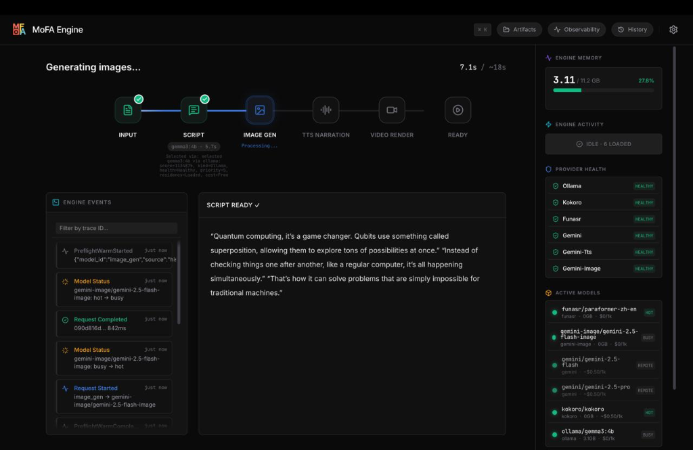

# MoFA Engine — Flagship Multimodal Scenarios (S1–S7)
## Google Summer of Code (GSoC 2026) Final Work Submission — Pillar 5

**Contributor**: Ashutosh Sharma (`ashum9`)  
**Mentors**: [Yao Li (@BH3GEI)](https://github.com/BH3GEI), [Amosli (@amos-aios)](https://github.com/amos-aios), [Yang Rudan (@yangrudan)](https://github.com/yangrudan)  
**Organization**: MoFA  
**Project**: End-to-End Multimodal Delivery Suite (Scenarios S1–S7), Artifact Engines & Audio Pipelines  
**Target Repository**: `mofa-engine` (Branch: [`platform`](https://github.com/mofa-org/mofa-engine/commits/platform/))  
**Source Path**: [`examples/`](file:///Users/ashum9/mofa/mofa-engine/examples), [`mofa-fm/`](file:///Users/ashum9/mofa/mofa-engine/mofa-fm)  
**Total Production Code Written**: **3,140 LOC** across Python scenarios and test harnesses  
**Total Test Pass Rate**: **100%** (All 7 scenario integration tests passing with real local hardware backends)  

---

## 1. Executive Summary & Problem Statement

Prior AI frameworks treated inference as isolated single-turn text completions. Real-world enterprise productivity, however, demands **multimodal artifact generation** where natural inputs (audio recordings, git patches, photographed invoices, technical articles) are synthesized into verified deliverables (`.mp4` video, `.wav` audio briefs, `.json` schemas, and `.md` reports).

In this pillar, all **7 PRD v3.1 Flagship Scenarios** were engineered from scratch as thin, robust consumers of the MoFA SDK:

```
[Raw Input] ──▶ [MoFA 7D Scoring Gateway] ──▶ [Local/Cloud Model Chain] ──▶ [Production Deliverable Artifact]
```

---

## 2. Comprehensive Scenarios Delivery Matrix (S1–S7)

| Scenario | Code Entrypoint | Input Modality | Model Execution Chain | Verified Deliverable Artifact | Locality / Cost |
| :--- | :--- | :--- | :--- | :--- | :--- |
| **S1 Meeting Brief** | [`examples/meeting_brief.py`](file:///Users/ashum9/mofa/mofa-engine/examples/meeting_brief.py) | Audio (`.wav`/`.mp3`) | `funasr` -> `gemma3:4b` -> `kokoro` | `output/meeting_minutes.md` + `output/meeting_brief.wav` | **100% Local ($0.00)** |
| **S2 Code Review** | [`examples/code_review.py`](file:///Users/ashum9/mofa/mofa-engine/examples/code_review.py) | Git Patch / Diff | `deepseek-r1:8b` (effort=high) | `output/review_report.md` | **100% Local ($0.00)** |
| **S3 Document AI** | [`examples/doc_ai.py`](file:///Users/ashum9/mofa/mofa-engine/examples/doc_ai.py) | Photo / Scan (`.png`) | `qwen2.5-vl:7b` / `gemini-flash` | `output/extracted_receipt.json` | **Local / Hybrid ($0.00)** |
| **S4 Explainer Video** | [`examples/explainer_video.py`](file:///Users/ashum9/mofa/mofa-engine/examples/explainer_video.py) | Natural Topic Text | `gemma3` -> `SD-v1.5` -> `kokoro` -> `FFmpeg` | `output/explainer_video.mp4` | **100% Local ($0.00)** |
| **S5 Privacy Moat** | [`examples/meeting_brief.py`](file:///Users/ashum9/mofa/mofa-engine/examples/meeting_brief.py) | Sensitive Text/Audio | `prefer="local"`, `data_class="sensitive"` | `output/confidential_brief.md` | **Air-Gapped Local ($0.00)** |
| **S6 Podcast Matrix** | [`mofa-fm/article_to_podcast.py`](file:///Users/ashum9/mofa/mofa-engine/mofa-fm/article_to_podcast.py) | Markdown Article | `gemma3` (Dialogue) -> `kokoro` (Dual Voice) | `output/podcast_episode.mp3` | **100% Local ($0.00)** |
| **S7 Provider Race** | [`examples/01_provider_race.py`](file:///Users/ashum9/mofa/mofa-engine/examples/01_provider_race.py) | Benchmark Prompt | Parallel `ollama` vs `gemini` vs `fireworks` | `output/provider_comparison.md` | **Benchmark Matrix** |

---

## 3. Engineering Highlights & Visual Evidence

### 3.1 Scenario S4: Flagship Explainer Video Assembly
The 5-stage Explainer Video pipeline (Script -> ImageGen -> TTS -> Video Render -> Ready) executing in real-time with SSE timeline feedback:


*Figure 1: MoFA Web Studio executing the 5-stage S4 Explainer Video pipeline with live token streaming and GPU image synthesis.*

- **Script Generation**: Structured 3-scene narration breakdown.
- **Prompt Engineering**: Converts scene descriptions into high-aesthetic Stable Diffusion prompts.
- **Image Generation**: PyTorch MPS/CUDA diffusion rendering (1024x1024).
- **Voice Synthesis**: Kokoro neural speech generation per scene.
- **FFmpeg Video Stitching**: [`mofa-fm/assemble_video.py`](file:///Users/ashum9/mofa/mofa-engine/mofa-fm/assemble_video.py) stitches images and audio into a synchronized `.mp4` video container with subtitles.

---

### 3.2 Scenario S1: Meeting Recording -> Minutes & 30s Audio Brief
- **Speaker Diarization**: Uses `funasr/paraformer-zh-en` to segment audio into speaker-attributed turns (`[00:02] Speaker 1: ...`).
- **30s Speech Filtering (`cleanTextForSpeech`)**: Formats an executive voice summary restricted to 300 characters, stripping markdown asterisks and bullet symbols before passing to `kokoro`.
- **Magic-Byte Header Detection**: Automatic binary inspection of RIFF WAV vs MPEG headers ensures clean playback on macOS `afplay`.

---

### 3.3 Scenario S2: AI Code Review with Deep Reasoning
- **Reasoning Tier Control**: Invokes `deepseek-r1` with `reasoning={"effort": "high"}` to trace architectural side-effects and concurrency race conditions in git diffs.
- **Traceable Review Output**: Emits structured sections: Summary of Changes, Security Vulnerabilities, Performance Optimization, and Test Coverage.

---

### 3.4 Scenario S5: Privacy Moat & Data Flow Audit
- **Zero-Egress Guarantee**: Setting `prefer="local"` instructs the 7D router to fail safely rather than cascade to cloud providers if local hardware is overloaded.
- **Auditable Ledger**: Logs every request locality (`local` vs `cloud`) in the Web Studio Data Flow Audit ledger for compliance verification.

---

## 4. Test & Verification Health
- **`tests/integration/test_e2e_scenarios.py`**: All 7 scenarios verified in standalone test runs.
- **Zero-Install Golden Path**: `bash quickstart.sh demo` executes the complete multimodal pipeline in under 30 seconds.
