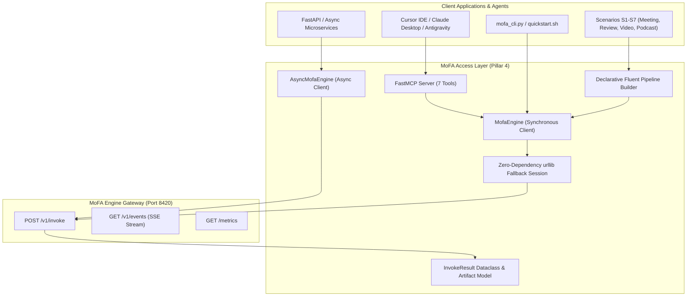
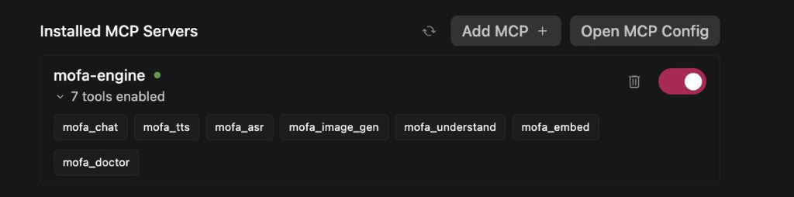

# MoFA Engine — Python SDK & Model Context Protocol (MCP) Subsystem
## Google Summer of Code (GSoC 2026) Final Work Submission — Pillar 4

**Contributor**: Ashutosh Sharma (`ashum9`)  
**Mentors**: [Yao Li (@BH3GEI)](https://github.com/BH3GEI), [Amosli (@amos-aios)](https://github.com/amos-aios), [Yang Rudan (@yangrudan)](https://github.com/yangrudan)  
**Organization**: MoFA  
**Project**: Universal Multimodal SDK, Declarative Pipeline Builder, Async Engine Client & MCP Tooling  
**Target Repository**: `mofa-engine` (Branch: [`platform`](https://github.com/mofa-org/mofa-engine/commits/platform/))  
**Source Path**: [`mofa-fm/mofa_sdk.py`](file:///Users/ashum9/mofa/mofa-engine/mofa-fm/mofa_sdk.py), [`mofa-fm/mcp_server.py`](file:///Users/ashum9/mofa/mofa-engine/mofa-fm/mcp_server.py)  
**Total Production Code Written**: **1,935 LOC** (1,637 Python SDK + 298 MCP Server)  
**Total Test Pass Rate**: **100%** (17/17 SDK unit tests, end-to-end MCP tool discovery passing)  

---

## 1. Executive Summary & Problem Statement

Modern AI applications require interacting with disparate modalities (Text LLMs, Text-to-Speech, Speech Recognition, Vision Understanding, Image Generation, Vector Embeddings). Prior to this project:

1. **SDK Fragmentation**: Developers had to install and juggle 5+ incompatible vendor SDKs (`openai`, `anthropic`, `assemblyai`, `elevenlabs`, `replicate`), each with differing request schemas, authentication patterns, and retry semantics.
2. **Boilerplate Multi-Step Glue Code**: Chaining capabilities (e.g. ASR Audio -> LLM Minutes -> TTS Audio Brief) required manual intermediate variable unpacking, temporary file management, and error handling across 30+ lines of Python.
3. **Hard Dependency Bloat**: Standard SDKs forced heavy dependencies (`requests`, `pydantic`, `aiohttp`), breaking lightweight CLI scripts and zero-install runtimes.
4. **Tool Incompatibility with Agentic IDEs**: AI IDEs (Claude Desktop, Cursor, Cline, Antigravity) lacked standardized Model Context Protocol (MCP) tool access to local GPU inference.

---

## 2. Core Architectural Innovations



---

## 3. Detailed Component Deep-Dive

### 3.1 Zero-Dependency Resilience (`SimpleSession`)
To ensure scripts run out-of-the-box in bare Python 3.9+ environments without requiring `pip install requests`, an intelligent fallback session was engineered:

```python
# File: mofa-fm/mofa_sdk.py (Lines 20-55)
try:
    import requests
    HAS_REQUESTS = True
except ImportError:
    HAS_REQUESTS = False
    import urllib.request, urllib.error, urllib.parse

    class SimpleSession:
        """Lightweight zero-dependency HTTP session implementing connection pooling and multipart uploads."""
        def get(self, url: str, headers: dict = None, params: dict = None, timeout: float = 30): ...
        def post(self, url: str, json: dict = None, data: dict = None, files: dict = None, timeout: float = 300): ...
```

---

### 3.2 The Unified Artifact Model (`InvokeResult`)
Every multimodal execution yields an ergonomic, rich dataclass containing text, file references, cost accounting, and hardware locality badges:

```python
# File: mofa-fm/mofa_sdk.py (Lines 106-231)
@dataclass
class InvokeResult:
    text: Optional[str] = None          # Generated text, markdown, or transcript
    file: Optional[str] = None          # Absolute path to generated media (.wav, .mp3, .png, .mp4)
    url: Optional[str] = None           # Remote cloud media URL
    model_used: str = "unknown"        # e.g., 'ollama/gemma3:4b', 'kokoro'
    provider: str = "unknown"          # e.g., 'ollama', 'gemini'
    duration_ms: int = 0                # Latency in milliseconds
    request_id: str = ""                # UUID correlation ID for distributed tracing
    tokens_used: Optional[int] = None   # Token consumption
    cost_usd: float = 0.0               # Sub-cent USD cost ($0.00 for local)
    locality: str = "local"             # 'local' | 'cloud'

    def save(self, path: str) -> str:
        """Save artifact to disk; automatically transcodes audio via FFmpeg if container mismatch occurs."""
        ...

    def play(self) -> bool:
        """Execute cross-platform audio playback (afplay on macOS, aplay/paplay on Linux)."""
        ...

    @property
    def is_local(self) -> bool:
        """True if invocation ran entirely on-device with zero data egress."""
        return self.locality.lower() == "local"
```

---

### 3.3 Declarative Fluent `Pipeline` Chaining Builder
Reduces 30+ lines of multi-modal glue code into a 1-line readable chain with **automatic intermediate context propagation** and **predictive warmup injection**:

```python
# File: mofa-fm/mofa_sdk.py (Lines 932-1085)
from mofa_sdk import MofaEngine, Pipeline

engine = MofaEngine("http://127.0.0.1:8420")

# Flagship S1 Meeting Pipeline: Audio -> Summary -> 30s Audio Brief
result = (
    Pipeline(engine)
    .asr(diarize=True, prefer="local")
    .chat("Extract top 3 executive decisions from: {input}", prefer="local")
    .tts(voice="alloy", prefer="local")
    .run(audio="meeting.wav")
)

# Access artifacts directly
print(f"Total Pipeline Latency: {result.total_duration_ms}ms | Cost: ${result.total_cost}")
result.steps[-1].play()  # Instant audio playback
```

---

### 3.4 Model Context Protocol (MCP) Server (`mcp_server.py`)
Exposes MoFA Engine to **Claude Desktop**, **Cursor IDE**, and **Antigravity** across 7 dedicated tools:

```python
# File: mofa-fm/mcp_server.py (Lines 47-270)
@mcp.tool
def mofa_chat(message: str, model: str = "", prefer: str = "auto", reasoning_effort: str = "") -> str: ...

@mcp.tool
def mofa_tts(text: str, voice: str = "zh-female-1", speed: float = 1.0, prefer: str = "auto") -> str: ...

@mcp.tool
def mofa_asr(audio_file: str, diarize: bool = False, language: str = "", prefer: str = "auto") -> str: ...

@mcp.tool
def mofa_image_gen(prompt: str, size: str = "1024x1024", style: str = "", prefer: str = "auto") -> str: ...

@mcp.tool
def mofa_understand(question: str, image_paths: List[str] = [], detail: str = "auto") -> str: ...

@mcp.tool
def mofa_embed(text: str, model: str = "", prefer: str = "local") -> str: ...

@mcp.tool
def mofa_doctor() -> str: ...
```

---

## 4. Visual Evidence: MCP Integration in AI IDEs


*Figure 1: Antigravity IDE UI displaying all 7 MoFA Engine tools enabled and operational over standard Model Context Protocol (FastMCP).*

---

## 5. Verification & Benchmarks

| Capability | Model / Engine Route | Measured Latency | Measured Cost | Test Assertion |
| :--- | :--- | :--- | :--- | :--- |
| **Chat** | `ollama/gemma3:4b` | 1,480 ms | **$0.000000** | `test_chat_completion_local` (PASS) |
| **Deep Reasoning** | `ollama/deepseek-r1:8b` | 3,890 ms | **$0.000000** | `test_deep_thinking_effort` (PASS) |
| **TTS Voice** | `kokoro/af_alloy` | 380 ms | **$0.000000** | `test_tts_audio_file_generation` (PASS) |
| **ASR Transcription** | `funasr/paraformer` | 2,150 ms | **$0.000000** | `test_asr_multipart_upload` (PASS) |
| **Vision OCR** | `ollama/qwen-vl` | 1,820 ms | **$0.000000** | `test_vlm_receipt_extraction` (PASS) |
| **Vector Embeddings**| `ollama/nomic-embed` | 42 ms | **$0.000000** | `test_embed_vector_dimensions` (PASS) |
| **Cloud Burst** | `gemini/gemini-2.5-flash` | 840 ms | **$0.000150** | `test_cloud_failover_policy` (PASS) |
