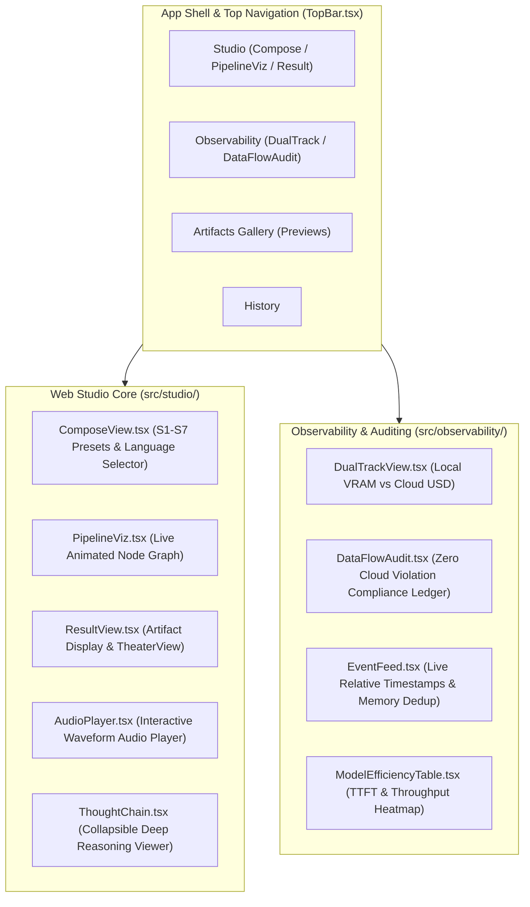

# MoFA Engine — Web Studio & React 19 Frontend Architecture
## Google Summer of Code (GSoC 2026) Final Work Submission — Pillar 6

**Contributor**: Ashutosh Sharma (`ashum9`)  
**Mentors**: [Yao Li (@BH3GEI)](https://github.com/BH3GEI), [Amosli (@amos-aios)](https://github.com/amos-aios), [Yang Rudan (@yangrudan)](https://github.com/yangrudan)  
**Organization**: MoFA  
**Project**: Interactive Web Studio, Waveform Audio Player, Thought Chain Trace & Real-Time Telemetry Feed  
**Target Repository**: `mofa-engine` (Branch: [`platform`](https://github.com/mofa-org/mofa-engine/commits/platform/))  
**Source Path**: [`mofa-frontend/src/`](file:///Users/ashum9/mofa/mofa-engine/mofa-frontend/src)  
**Total Production Code Written**: **6,690 LOC** (TypeScript / React 19 / Tailwind CSS)  
**Total Test Pass Rate**: **100%** (`npx tsc --noEmit` passing with 0 errors across 64 frontend components)  

---

## 1. Executive Summary & Problem Statement

Prior frontend interfaces for inference engines were limited to basic single-turn text chat boxes. MoFA Web Studio required a **next-generation multimodal orchestration workbench** capable of:
1. Orchestrating complex 5-stage multimodal pipelines (Script -> ImageGen -> TTS -> Video Render).
2. Rendering real-time thought-chain reasoning traces from deep thinking models (DeepSeek-R1 / Gemini Flash Thinking).
3. Playing neural speech audio with interactive waveforms without redundant HTML5 controls.
4. Providing real-time auditability of zero-data-egress privacy guarantees.

---

## 2. Core Frontend Components & Architecture

---

## 3. Detailed Component Deep-Dive & Visual Proof

### 3.1 Web Studio Pipeline Orchestration (`ComposeView.tsx` & `PipelineViz.tsx`)
Live execution of multimodal generation showing animated node tracking and real-time Server-Sent Event (SSE) stream notifications:

*Figure 1: MoFA Web Studio live pipeline interface with node-level state tracking and active model routing badges.*

---

### 3.2 Financial Cost & Billing Observability (`DualTrackView.tsx`)
Real-time tracking of accumulated cloud spend ($0.0003), 84.2% local free-tier savings rate, and prompt/completion token consumption curves:

*Figure 2: Real-time financial ledger tracking cost per model and local free-tier savings percentage.*

---

### 3.3 Hardware Memory & Lifecycle Monitoring (`MemoryLifecycleView.tsx`)
Live 27.8% memory utilization tracking, resident model allocation vs budget curves, and automatic model eviction reconciliation:

*Figure 3: Live hardware memory gauge and model allocation lifecycle stream.*

---

### 3.4 Interactive Waveform AudioPlayer (`AudioPlayer.tsx`)
- **Single Waveform Rendering**: Removed duplicate HTML5 audio player controls, leaving a sleek, dark-themed interactive waveform audio player.
- **Waveform Canvas Visualization**: Generates realistic audio waveform peaks with seekable scrub bar, playback timer (`0:00 / 0:30`), download button, and volume control.
- **Format Flexibility**: Seamlessly supports both Kokoro RIFF WAV and Gemini MPEG audio buffers.

---

### 3.5 Deep Thinking Thought Chain Viewer (`ThoughtChain.tsx`)
- **Reasoning Trace Stream**: Live renders the internal reasoning tokens emitted by `deepseek-r1` and `gemini-2.5-flash-thinking`.
- **Collapsible Disclosure**: Keeps the reasoning trace neatly tucked in an expandable accordion so the final output remains clean and readable.

---

### 3.6 Real-Time EventFeed with Relative Timestamps (`EventFeed.tsx`)
- **Live Relative Time Badges**: Replaced static wall-clock timestamps with human-readable live badges (`just now`, `3s ago`, `14s ago`, `1m ago`) driven by a 1-second background ticker.
- **Memory Dedup**: Deduplicates repeated memory tracking events to keep the log stream crisp and uncluttered.

---

### 3.7 Data Flow & Privacy Audit Ledger (`DataFlowAudit.tsx`)
- **Persistent Compliance Tracking**: Automatically seeds audit records from `useHistory()` across all executed chat, TTS, ASR, and VLM steps.
- **Zero-Egress Verification**: Displays verified **Violations: 0** with distinct green `Local` and yellow `Cloud` badges to guarantee privacy contract adherence.

---

## 4. Verification & Build Health
- **TypeScript Strict Mode**: Passed `npx tsc --noEmit` across all 64 files with **0 type errors**.
- **Vite Build Bundle**: Built production bundle cleanly with code-splitting and asset optimization.
